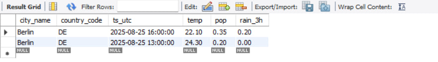
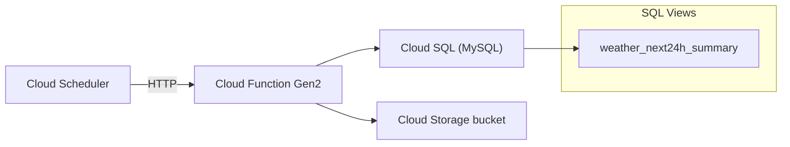

## Architecture
## Sample query result

```mermaid
flowchart LR
  sch["Cloud Scheduler"] -->|HTTP| fn["Cloud Function Gen2"]
  fn --> sql["Cloud SQL (MySQL)"]
  fn --> bkt["Cloud Storage bucket"]

  subgraph SQL_Views["SQL Views"]
    v1["weather_next24h_summary"]
  end

  sql --> v1
```
  

